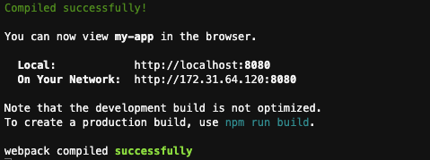
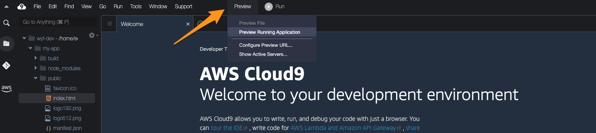

# Week 2 : Storage

## Pre-requisites:

- Exercises from Week 1 
- A working Cloud9 environment in an AWS account.

## Agenda:
- Introduction to AWS storage services and static web hosting on AWS - 1.5 hours
- Class assigments - 1.5 hours

## Class assignments 

### Previewing a simple React app in the Cloud 9 environment

Start off by creating a simple react app with the [create-react-app](https://github.com/facebook/create-react-app) command. 

You do this by typing the following command in the Cloud9 environment:

```
npx create-react-app my-app
```

You will notice that the command is not installed in the Cloud9 environment, so before it can be executed, it will automatically be installed. 

Access the directory of the application by typing:
```
cd my-app
``` 

Run the command `npm start` to run your app locally in the Cloud9 environment.

You should see a confirmation message similar to the following. 


Ignore the two IPs that you see in the console. If you want to preview the application, look for the preview button on the top bar of Cloud9. 



### Hosting a simple React app publicly on S3

Compile the app by executing the command `npm run build`. This will create the files for the websites we need to upload to S3.

To upload the files, we first create a bucket by using the [create-bucket](https://awscli.amazonaws.com/v2/documentation/api/latest/reference/s3api/create-bucket.html) command.

##### For the us-east-1 region
```
aws s3api create-bucket --bucket hyf-hosting-<RANDOM_ID> --region us-east-1
```
##### For any other region
```
aws s3api create-bucket --bucket hyf-hosting-<RANDOM_ID> --region <REGION-ID> --create-bucket-configuration LocationConstraint=<REGION-ID>
```

Then we leverage the [sync command](https://docs.aws.amazon.com/cli/latest/reference/s3/sync.html), to sync our freshly build files to the bucket.

```
aws s3 sync ./build s3://hyf-hosting-<RANDOM_ID>
```

Finally, we enable web hosting with the [website command](https://docs.aws.amazon.com/cli/latest/reference/s3/website.html):

```
aws s3 website s3://hyf-hosting-<RANDOM_ID> --index-document index.html --error-document error.html
```

Navigate into the AWS Console and find your bucket. What is the url, and what is the bucket policy?

Make a change to your website and reflect the changes to your bucket with the `sync` command.

 Find someone in class and ask them to visit and verify that your website works.

### Cleanup

Delete the bucket once you verified that the app works. 

### Discussion
1. How would you normally host a website?
1. Why is S3 serverless ?
1. What are eventual and strong consistency? Why are they important? 
