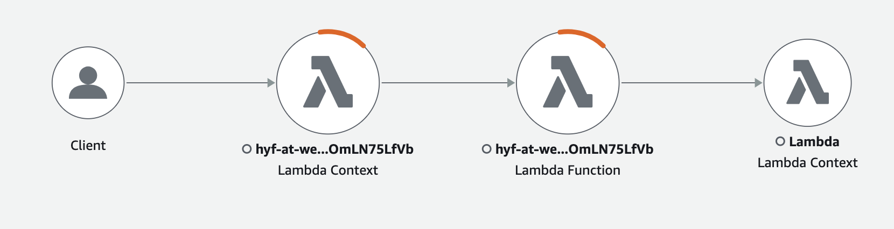
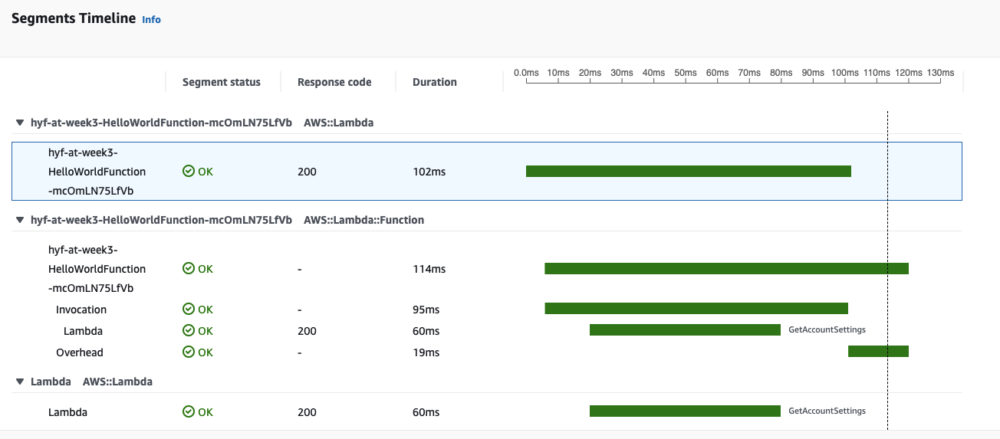

# Week 3 : Topic #3

## Pre-requisites:

- Exercises from Week 2 
- A working Cloud9 environment in an AWS account.

## Agenda 
- Introduction to Compute and AWS Lambda - 30 minutes
- Introduction to monitoring services: Amazon Cloudwatch and Amazon X-Ray - 30 minutes
- Introduction to different high-level frameworks for serverless on AWS (SAM, Amplify, etc.) - 30 minutes
- Class assignments - 1.5 hours

## Class assignments 

### Verify that SAM is installed

We will use [SAM](https://docs.aws.amazon.com/serverless-application-model/latest/developerguide/what-is-sam.html) to run and develop our serverless applications in AWS.

The SAM CLI already comes pre-installed in your Cloud9 environment. 

Run the following command to check what SAM CLI version you are running:
```
sam --version
``` 

### Create your first Lambda function

Our first assignment will be to create our first Lambda function.

The SAM CLI has a lot of utility, for all of Lambdas usecases (scheduled executions, APIs, queues, custom events and more), but we will start out simple by creating a Lambda function that just outputs 'Hello World!'.

After SAM has been installed, we will initiate a new project with:

`sam init`

These are the arguments you need to provide:

1. Chose `AWS Quick Start Templates` as template source,
2. Choose `Zip` as package type.
3. Choose `nodejs14.x` as runtime.
4. Type `hyf-{your-credentials}-week3` as the name, e.g `hyf-at-week3`.
5. Choose `Quick Start: Hello World Example` as an app template.

This will create a node boilerplate that we can test the function in our Cloud9 environment with SAM by running:

`sam local invoke HelloWorldFunction`.

### Deploy your lambda with SAM to AWS

To deploy a lambda to AWS through SAM, we will need to create what is called a [CloudFormation stack](https://aws.amazon.com/cloudformation/) just like we did in week 2 with the S3 bucket. Think of stacks as a recipe of cloud resources and their configuration for a given IT solution/system/environment.

First, we build the lambda running `sam build`. Next we can run `sam deploy --guided`. The arguments will need to be as follows:

1. Type `hyf-{your-credentials}-week3` as the stack name, e.g `hyf-at-week3`.
2. Choose default region (us-east-1)
3. Confirm IAM role creation, lack of authorization, etc.
4. Save arguments to the configuration file 

Your lambda is now deployed and you can find it inside both the cloudformation and lambda UI on the AWS console.

### Triggering the Lambda function

As we could see, the Lambda service can be emulated locally using SAM.

To trigger the deployed Lambda function, you have two options:
- If you inspect the `template.yaml` file generated by SAM, you will see that the Lambda function is also wired to an event of type API. We will cover APIs in more detail in the upcoming weeks, but for now make a note of the Output URL. You can access this in your own CloudFormation template output to trigger the Lambda function
- You can trigger the Lambda function manually from the Lambda service console. You will have to create a test event before clicking the test button.

### Monitoring the Lambda function
AWS Lambda automatically monitors Lambda functions on your behalf, reporting metrics through Amazon CloudWatch.

You can insert logging statements into your code to help you validate that your code is working as expected. Lambda automatically integrates with CloudWatch Logs and pushes all logs from your code to a CloudWatch Logs group associated with a Lambda function, which is named `/aws/lambda/<function name>`.

Insert the following commands right before the response assignment statement:
```
  console.log("ENVIRONMENT VARIABLES: \n" + JSON.stringify(process.env, null, 2));
  console.log("CONTEXT: \n" + JSON.stringify(context, null, 2));
  console.info("EVENT:\n" + JSON.stringify(event, null, 2));
  console.warn("This is a warning.");
```

Then redeploy the function and call it a few times either through the API endpoint or manually from the Lambda interface.

You can view logs for Lambda functions using the Lambda console, the CloudWatch console, the AWS Command Line Interface (AWS CLI), or the CloudWatch API.

Navigate to your Lambda function in the Lambda console and click the monitor tab.
- Make a note of the different metrics available for the Lambda function
- Then click on `View logs in CloudWatch` and inspect the output from your functions

### Implementing tracing for the lambda function

In order to visualize tracing capabilities, let us now change the Lambda function so that it actually calls the Lambda API. 


First, add the `aws-xray-sdk-core` package to the `package.json` file:
```
  "dependencies": {
    "axios": "^0.21.1",
    "aws-xray-sdk-core": "1.1.2"
  }
```

Change your code for the Lambda function so that it looks similar to the below:

```
const AWSXRay = require('aws-xray-sdk-core');
const AWS = AWSXRay.captureAWS(require('aws-sdk'));
let response;

// Create client outside of handler to reuse
const lambda = new AWS.Lambda()

/**
 *
 * Event doc: https://docs.aws.amazon.com/apigateway/latest/developerguide/set-up-lambda-proxy-integrations.html#api-gateway-simple-proxy-for-lambda-input-format
 * @param {Object} event - API Gateway Lambda Proxy Input Format
 *
 * Context doc: https://docs.aws.amazon.com/lambda/latest/dg/nodejs-prog-model-context.html 
 * @param {Object} context
 *
 * Return doc: https://docs.aws.amazon.com/apigateway/latest/developerguide/set-up-lambda-proxy-integrations.html
 * @returns {Object} object - API Gateway Lambda Proxy Output Format
 * 
 */
exports.lambdaHandler = async (event, context) => {
    try {
        console.log("ENVIRONMENT VARIABLES: \n" + JSON.stringify(process.env, null, 2));
        console.log("CONTEXT: \n" + JSON.stringify(context, null, 2));
        console.info("EVENT:\n" + JSON.stringify(event, null, 2));
        console.log("ACCOUNT SETTINGS: \n" + await getAccountSettings());
        console.warn("This is a warning.");
        response = {
            'statusCode': 200,
            'body': JSON.stringify({
                message: 'Hello world!',
                // location: ret.data.trim()
            })
        }
    } catch (err) {
        console.log(err);
        return err;
    }

    return response;
};

var getAccountSettings = function(){
  return lambda.getAccountSettings().promise();
}

```

We also need to enable tracing on the Lambda function itself, and give it permission to write to the X-Ray service. In order to do this, add the following to the `template.yaml` file, under `Properties`:

```
      Policies:
        - AWSLambdaBasicExecutionRole
        - AWSLambda_ReadOnlyAccess
        - AWSXrayWriteOnlyAccess
      Tracing: Active
```

Now call the function several times by calling the API endpoint. 

The application uses AWS X-Ray to trace requests. Open the X-Ray console and navigate to X-Ray traces>Service map in order to view the service map. The following service map shows the function calling The Lambda Service.



Choose a node in the main function graph. Then choose View traces to see a list of traces. Choose any trace to view a timeline that breaks down the work done by the function.



